# tkinter-GUI-program 🚀
A collection of some tkinter GUI programs

Here are some of the tkinter applets I wrote about before. If you're interested, you can check it out. ✨

## Attention ⚠️

I had a low level of programming before, and the code was of low or bad quality, please forgive me. 😅

Some programs contain resource files, please switch to the corresponding folder before running, otherwise the program will not be able to find the corresponding resource files.

There are also programs that require some dependencies, and the names of the dependencies are placed in `requirement.txt`.

For all applets, `main.py` is the startup file.

## Contents 📑

There are two main directories, based on `tkinter.ttk` and `tkinter`.

### ttk

- [X] **login window**

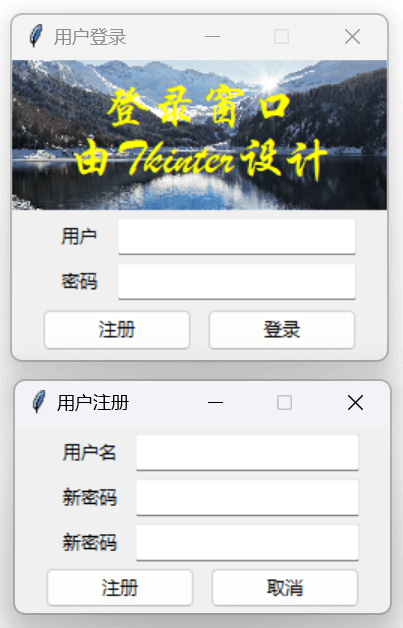

- [X] **calculator**

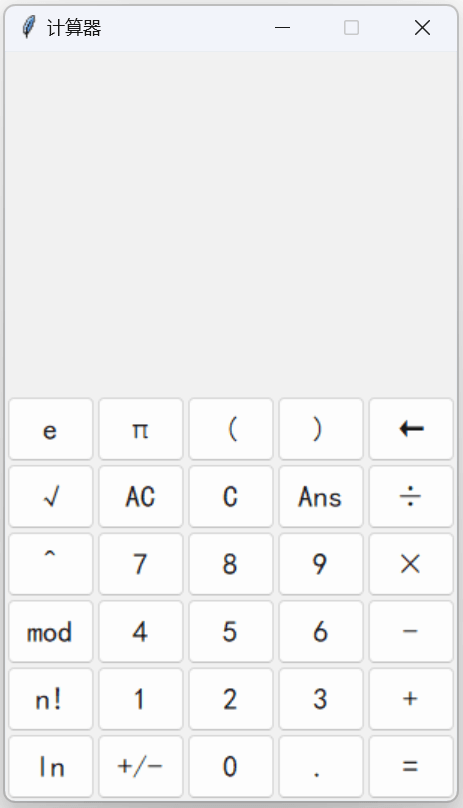

- [X] **random named**

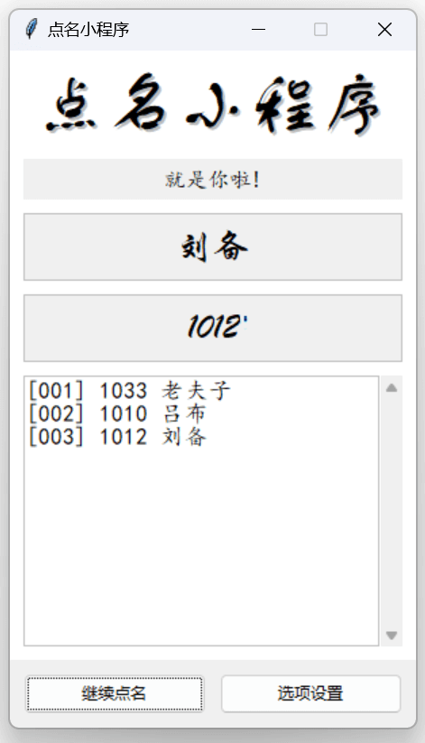

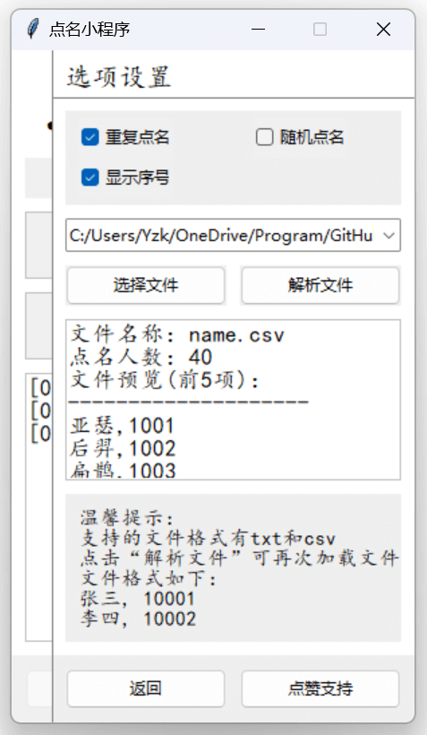

### tk

- [X] **login window**

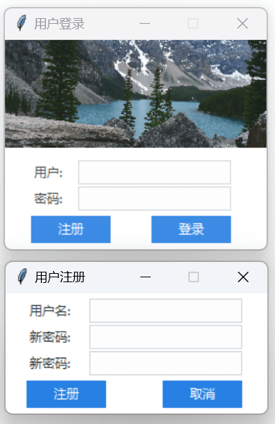

- [X] **calculator**

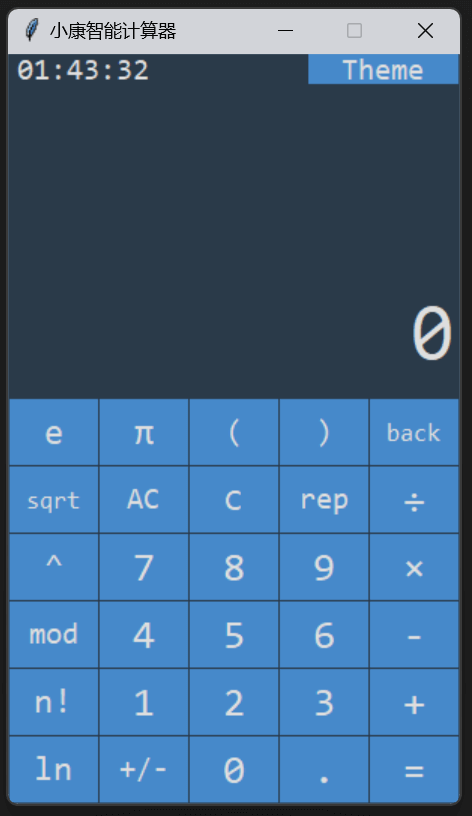

- [X] **random named**

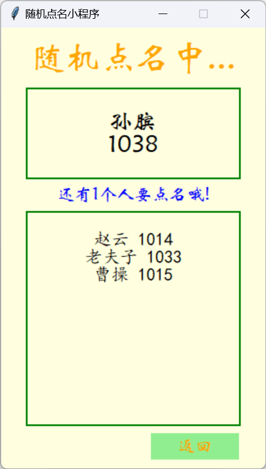

- [X] **2048Game**

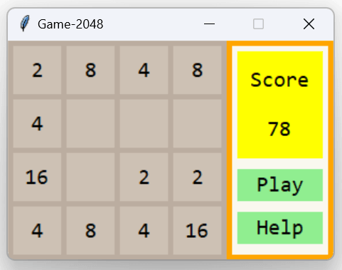

- [X] **fish**

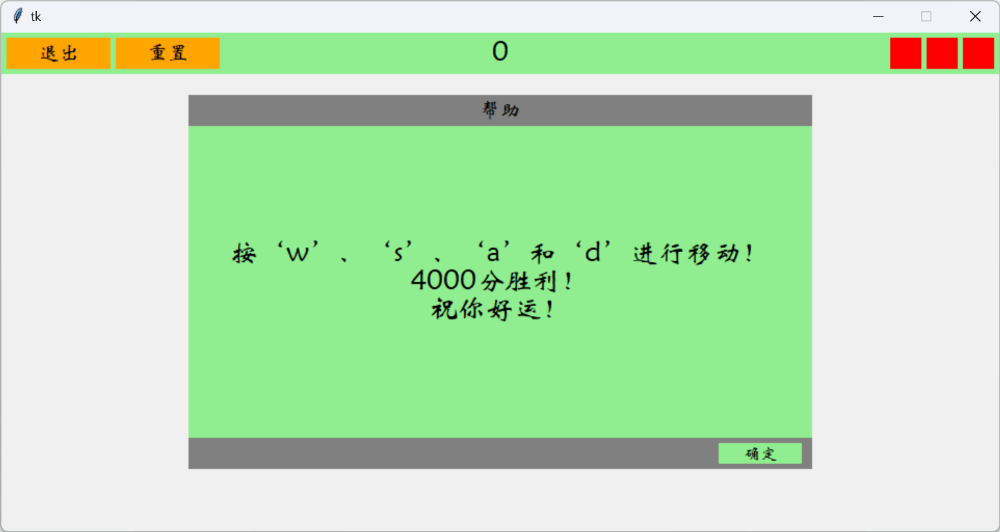

- [X] **GameBox**

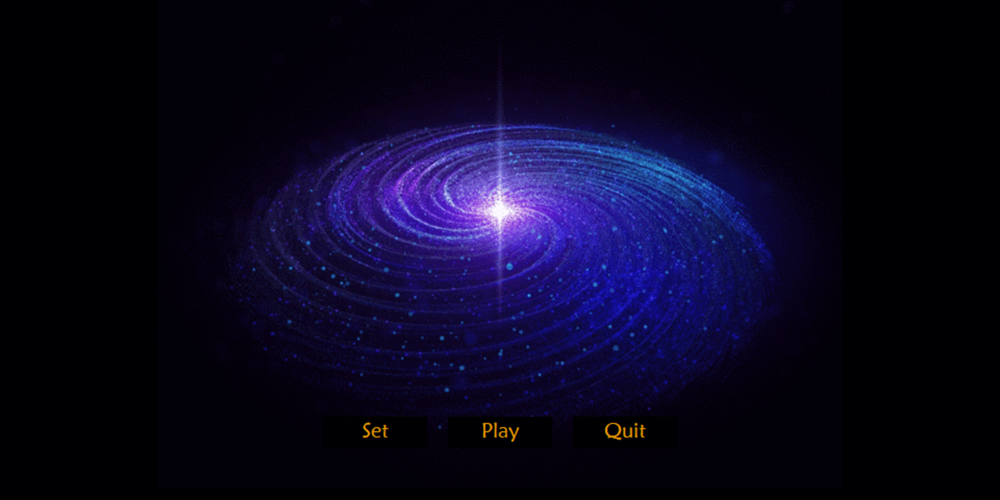

- [X] **DoubleDragon**

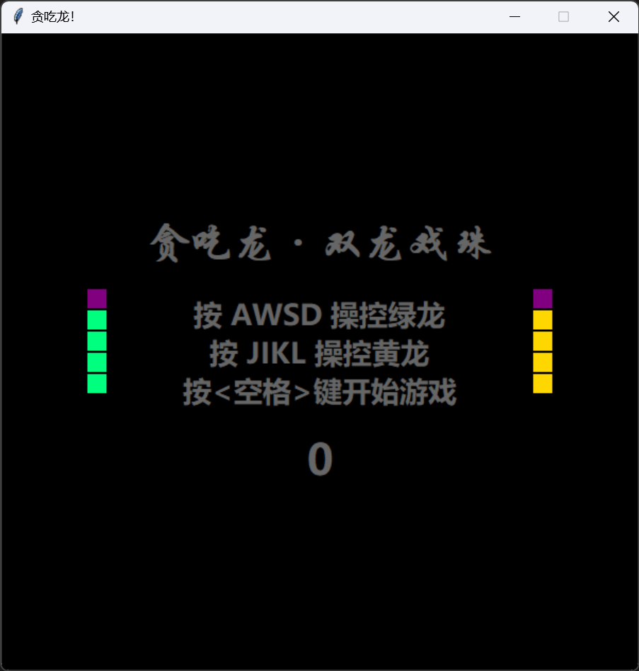

- [X] **Gobang**

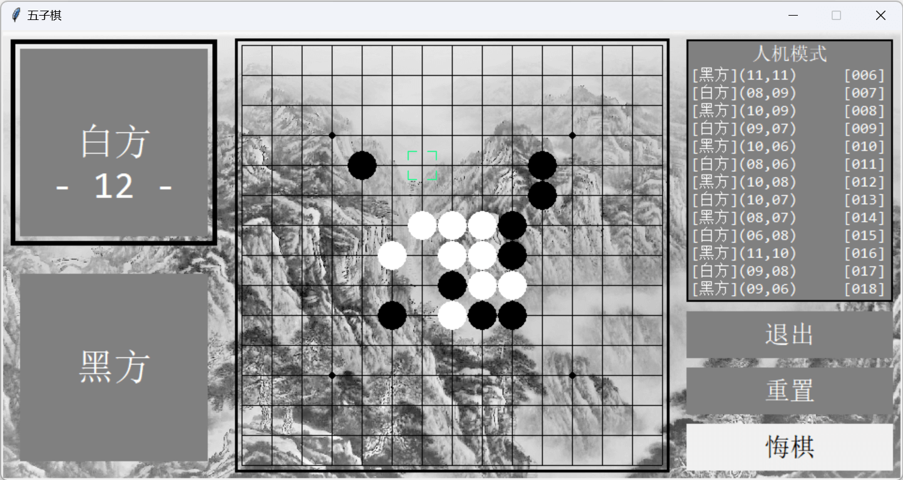

- [X] **ChinaChess**

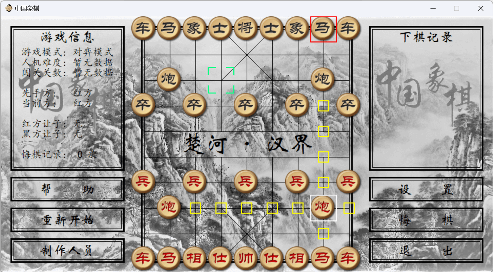

---

For all of these applets, I won't have any updates to them. Of course, if you want to make changes to them, and make a PR, I'd be glad to do it! ❤️
